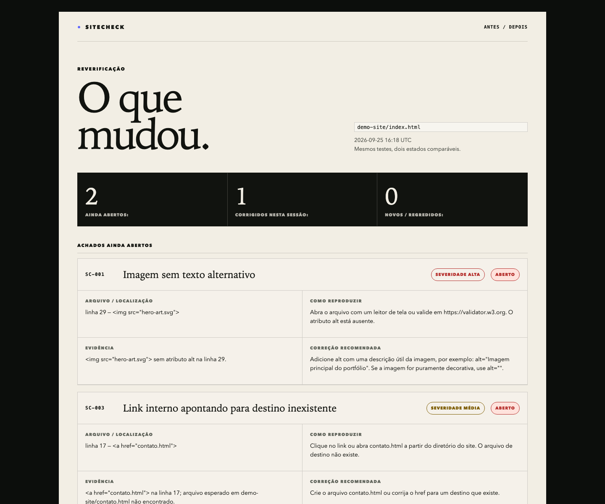

# SiteCheck

SiteCheck ajuda designers, desenvolvedores independentes e pequenos times a transformar problemas verificáveis de um site em uma lista curta de correções que pode ser compreendida, aplicada e testada novamente.

## Princípio

Poucos achados, boa evidência e uma correção comprovada valem mais do que uma auditoria extensa e genérica.

## Requisitos

Python 3.8 ou superior. Sem dependências externas — apenas a biblioteca padrão.

## Uso

```sh
# verificar um arquivo HTML
python3 sitecheck.py demo-site/index.html

# especificar diretório de saída
python3 sitecheck.py demo-site/index.html --out-dir meu-relatorio

# comparar dois relatórios (fluxo antes/depois)
python3 recheck.py sitecheck-output/before/report.json sitecheck-output/after/report.json
```

`sitecheck.py` escreve `report.json` e `report.html` no diretório de saída.
`recheck.py` lê dois relatórios JSON e escreve `comparison.json` e `comparison.html`.

`sitecheck.py` retorna exit code `1` quando há achados e `0` quando não há.
`recheck.py` retorna `0` quando a comparação é gerada com sucesso; o estado dos achados fica registrado no JSON e no HTML.

## Testes

```sh
python3 -m unittest discover test
```

42 testes unitários cobrindo os três checkers, o schema, a lógica de comparação, regressões e os relatórios reais gerados nas sessões.

## Demo

O diretório `demo-site/` contém uma página com falhas intencionais usada para demonstrar o fluxo antes/depois:

| ID     | Falha                                           | Severidade | Estado após sessão 03 |
|--------|-------------------------------------------------|------------|-----------------------|
| SC-001 | Imagem sem texto alternativo                    | Alta       | Aberto (priorizado depois) |
| SC-002 | Campo de formulário sem rótulo associado        | Alta       | **Corrigido** |
| SC-003 | Link interno apontando para destino inexistente | Média      | Aberto (priorizado depois) |

SC-001 e SC-003 foram mantidos abertos intencionalmente para demonstrar que a ferramenta
prioriza correções — não exige resolver tudo de uma vez.

## Direção de arte

A demonstração e os relatórios usam o mesmo sistema visual: papel quente, preto profundo,
verde ácido para confirmação, azul cobalto para identidade e coral para alerta. Títulos em
serifa editorial criam contraste com a interface funcional em sans-serif e dados em
monoespaçada.

O sistema é autocontido e usa apenas fontes do sistema, sem depender de CDN ou serviço
externo. A composição, a ilustração vetorial e a hierarquia foram desenhadas para tornar a
evidência técnica legível sem apagar o caráter autoral do projeto.




Decisões e especificações visuais: [`docs/ART-DIRECTION.md`](docs/ART-DIRECTION.md).

## Estrutura

```
src/
  schema.py       contrato de um achado e do relatório
  checkers.py     três verificadores determinísticos
  reporter.py     gerador de report.json e report.html
  compare.py      lógica de comparação antes/depois
sitecheck.py      CLI de verificação
recheck.py        CLI de comparação antes/depois
demo-site/        site de demonstração
sitecheck-output/
  before/         relatório do estado com os três achados abertos
  after/          relatório após correção do SC-002
  comparison/     artefato de comparação antes/depois
test/             testes unitários (unittest, stdlib)
docs/             especificação, brief e registros de sessão
```

## Escopo

Sem login, sem serviços externos, sem telemetria, sem dados de cliente.
Os verificadores detectam padrões específicos — não prometem cobertura completa de acessibilidade nem de qualidade.

## Estado

Sessão 03 concluída: fluxo de reverificação implementado, SC-002 corrigido, 42 testes passando.
