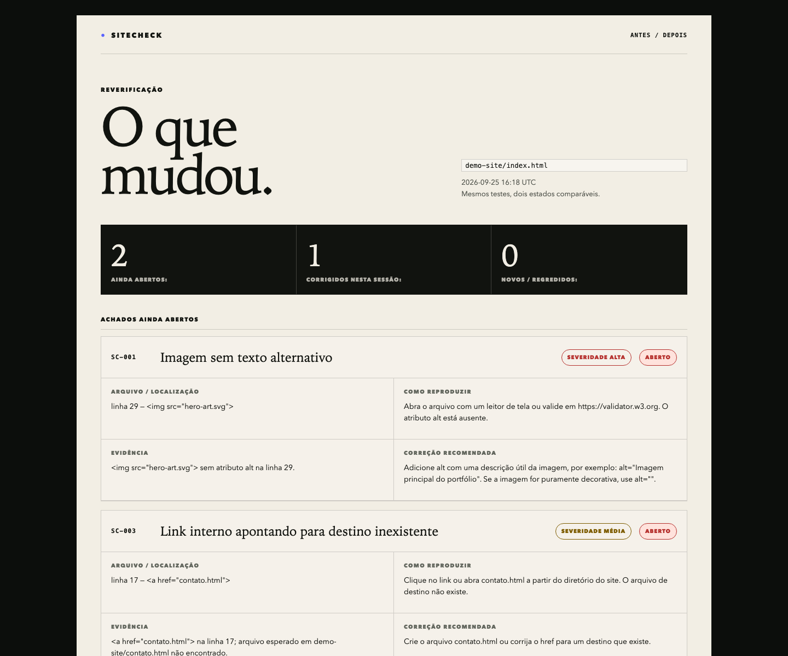

# SiteCheck

SiteCheck helps designers, independent developers, and small teams turn verifiable website problems into a short list of fixes that can be understood, applied, and tested again.

## Principle

A few findings with clear evidence and a verified fix are more useful than a broad, generic audit.

## Requirements

Python 3.10 or newer. No external dependencies; SiteCheck uses only the standard library.

## Usage

```sh
# inspect an HTML file
python3 sitecheck.py demo-site/index.html

# choose an output directory
python3 sitecheck.py demo-site/index.html --out-dir my-report

# compare two reports in a before/after workflow
python3 recheck.py sitecheck-output/before/report.json sitecheck-output/after/report.json
```

`sitecheck.py` writes `report.json` and `report.html` to the output directory. `recheck.py` reads two JSON reports and writes `comparison.json` and `comparison.html`.

`sitecheck.py` exits with code `1` when findings exist and `0` when none exist. `recheck.py` exits with `0` when the comparison is generated; finding status remains explicit in the JSON and HTML artifacts.

## Tests

```sh
python3 -m unittest discover test
```

The suite includes 71 unit tests covering all three checkers, the report schema, before/after comparison, regression handling, and the real reports produced during the documented sessions.

## Demo

Try the interactive browser prototype:
https://athosfif.github.io/sitecheck-ibm-bob/

The online prototype accepts pasted HTML or local HTML files, runs the same three focused review rules in the browser, applies the demonstrated form-label fix, rechecks the result, and exports the evidence as JSON. Files stay in the browser and are not uploaded.

The original narrated video records the September 25 baseline (42 tests). It includes a real run of the analyzer, the before/after comparison, and the complete test suite:
https://youtu.be/Esc6inzvVJw

`demo-site/` contains a page with three intentional defects used to demonstrate the workflow:

| ID | Finding | Severity | Status after session 03 |
|---|---|---:|---|
| SC-001 | Image without alternative text | High | Open, intentionally deferred |
| SC-002 | Form field without an associated label | High | **Fixed** |
| SC-003 | Internal link points to a missing destination | Medium | Open, intentionally deferred |

SC-001 and SC-003 remain open to demonstrate prioritization. SiteCheck does not force teams to treat every finding as equally urgent.

## Art direction

The demo and reports share one visual system: warm paper, deep black, acid green for confirmation, cobalt for identity, and coral for alerts. Sequel is used for the authored presentation and video; public browser artifacts use a compatible local fallback when that licensed font is unavailable. Functional text stays in a clean sans serif, while data uses a monospaced face.

The composition, vector illustration, and hierarchy are designed to make technical evidence easy to read without erasing the project's authorship.




See [`docs/ART-DIRECTION.md`](docs/ART-DIRECTION.md) for the visual decisions.

## Structure

```text
src/
  schema.py       finding and report contract
  checkers.py     three deterministic checks
  reporter.py     report.json and report.html generation
  compare.py      before/after comparison logic
sitecheck.py      inspection CLI
recheck.py        comparison CLI
demo-site/        intentionally flawed demonstration site
sitecheck-output/
  before/         report with three open findings
  after/          report after fixing SC-002
  comparison/     before/after evidence
test/             unittest test suite
docs/             specification, review notes, and IBM Bob session records
```

## Reproduce the evidence

```sh
python3 tools/reproduce_demo.py
python3 -m unittest discover test
```

The first command creates a fresh evidence directory and asserts the 3 -> 2 result without changing the preserved session reports.

## Scope

No login, external service, telemetry, or client data. The checkers detect a small set of explicit patterns; they do not claim complete accessibility or quality coverage.

## Current state

Session 03 is complete: the recheck workflow is implemented, SC-002 is verified as fixed, two findings remain intentionally open, there are zero regressions, and the original 42 tests passed. The September 26 review expanded the suite to 71 passing tests and added 17 browser verification scenarios. See [verification notes](docs/VERIFICATION-2026-09-26.md).

The local-link check resolves relative file paths, percent encoding, queries and fragments. External URLs, root-relative server routes and pages using a base URL are outside this check. A missing browser destination means absent from the supplied file set, not a confirmed HTTP 404. Form names are a focused static check, not the complete accessible-name algorithm. Comparison tracks individual occurrences; changing an element identity can appear as an old occurrence disappearing and a new one appearing.

## Updated presentation

- [September 26 verified video](https://athosfif.github.io/sitecheck-ibm-bob/SiteCheck-verification-r2.mp4)
- [Current pitch PDF](https://athosfif.github.io/sitecheck-ibm-bob/SiteCheck-Pitch-Deck.pdf)
- [Review notes and evidence](docs/VERIFICATION-2026-09-26.md)
